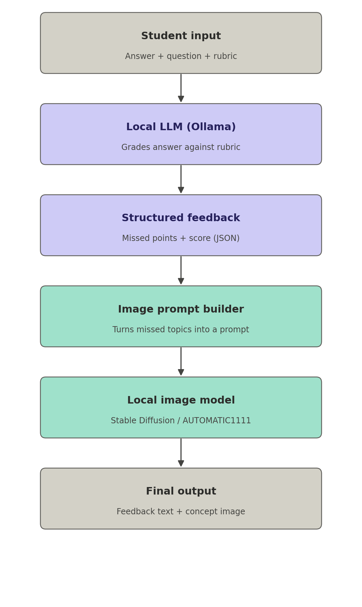
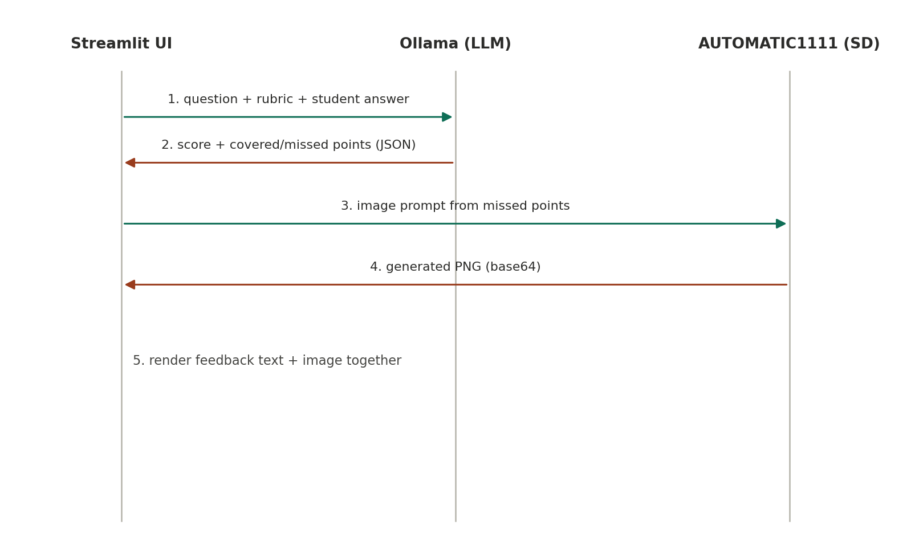

# Answer Feedback Tutor

A university project that combines a **local LLM** and a **local image generation model**
in a single workflow to help students see exactly which concepts they missed in a written
answer — and get a visual study aid for it, all running on a local machine with no cloud APIs.

## Problem statement

Students who write long-form answers (essays, short-answer exam questions, lab reports)
usually only get a score back, not a breakdown of *which specific concept* they missed.
Manually grading and giving point-by-point feedback is time-consuming for instructors and
TAs, and generic "you got 6/10" feedback doesn't tell a student what to actually go study.

This project automates that feedback loop: a student pastes their answer, a local LLM
compares it against a rubric of key concepts, and reports exactly which points were
covered and which were missed. For each missed concept, a local image generation model
produces a simple diagram, so the student walks away with something concrete to revise —
not just a list of things they got wrong.

## Features

- **Rubric-based grading** — compares a student's free-text answer against a list of
  expected key concepts for a given question, using a locally hosted LLM.
- **Structured feedback** — returns a numeric score plus explicit covered/missed concept
  lists, not just a single grade.
- **Automatic visual study aid** — builds an image prompt directly from the missed
  concepts and generates a diagram with a local Stable Diffusion model, so text
  grading and image generation are linked in one pipeline rather than being separate
  features.
- **Fully local** — both the LLM (via Ollama) and the image model (via AUTOMATIC1111's
  Stable Diffusion WebUI) run on your own machine. No OpenAI, Gemini, Claude, or other
  cloud API is used anywhere in the pipeline.
- **Simple web UI** — a single Streamlit page: pick a question, type an answer, get
  feedback and an image back.

## Architecture diagram



## Workflow diagram



The Streamlit UI sends the question, rubric, and student answer to Ollama and gets back
structured JSON. The missed points from that JSON are turned into a text-to-image prompt,
which is sent to the local Stable Diffusion API. The resulting image and the text feedback
are then displayed together on the same page.

## Tech stack

| Component | Tool |
|---|---|
| Local LLM | [Ollama](https://ollama.com) running Llama 3 or Mistral |
| Local image generation | [Stable Diffusion WebUI (AUTOMATIC1111)](https://github.com/AUTOMATIC1111/stable-diffusion-webui) via its REST API |
| App / UI | Python, Streamlit |
| Communication | HTTP requests to local endpoints (`localhost:11434`, `localhost:7860`) |

## Repository structure

```
answer-feedback-tutor/
├── README.md
├── LICENSE
├── .gitignore
├── requirements.txt
├── app.py                  ← Streamlit entry point
├── src/
│   ├── grading.py          ← builds grading prompt, calls Ollama, parses JSON
│   ├── image_gen.py        ← builds image prompt, calls Stable Diffusion API
│   └── utils.py            ← config + rubric loading helpers
├── docs/
│   ├── architecture.png
│   ├── workflow.png
│   └── screenshots/
├── models/                 ← place for local model config/notes (weights not committed)
├── data/
│   └── rubrics/sample_questions.json
├── outputs/                ← generated images land here (gitignored)
└── demo/
    └── demo.mp4
```

## Installation & usage

### 1. Prerequisites

- Python 3.10+
- [Ollama](https://ollama.com) installed
- [Stable Diffusion WebUI (AUTOMATIC1111)](https://github.com/AUTOMATIC1111/stable-diffusion-webui) installed

### 2. Start the local models

```bash
# Terminal 1 — start the local LLM
ollama pull llama3
ollama serve

# Terminal 2 — start local Stable Diffusion with its API enabled
cd stable-diffusion-webui
./webui.sh --api        # or webui-user.bat --api on Windows
```

Confirm both are reachable:

```bash
curl http://localhost:11434/api/generate -d '{"model":"llama3","prompt":"hello","stream":false}'
curl http://127.0.0.1:7860/sdapi/v1/sd-models
```

### 3. Set up this project

```bash
git clone <this-repo-url>
cd answer-feedback-tutor
python3 -m venv venv
source venv/bin/activate        # venv\Scripts\activate on Windows
pip install -r requirements.txt
```

### 4. Run the app

```bash
streamlit run app.py
```

Open the local URL Streamlit prints (usually `http://localhost:8501`), pick a question,
type an answer, and click **Grade my answer**.

### Configuration

If your Ollama or Stable Diffusion instance runs on a different host/port or model name,
set these environment variables before running:

```bash
export OLLAMA_HOST=http://localhost:11434
export OLLAMA_MODEL=llama3
export SD_HOST=http://127.0.0.1:7860
```

## Screenshots

See [`docs/screenshots/`](docs/screenshots/) — add captures of the question selector,
the graded result (score + covered/missed points), and the generated study diagram.

## Demo video

See [`demo/demo.mp4`](demo/demo.mp4) for a full walkthrough: selecting a question,
submitting an answer, and viewing the generated feedback and diagram.

## Limitations / future work

- Rubrics are currently defined manually per question (`data/rubrics/sample_questions.json`).
  A future version could let instructors upload a rubric directly.
- No OCR/image-upload input yet — answers are typed, not scanned from handwritten work.
  This was scoped out deliberately to keep the pipeline reliable; it's a natural extension.
- Grading quality depends on the local LLM used — larger local models (e.g. Llama 3 70B,
  if hardware allows) will generally give more consistent JSON and more accurate grading
  than smaller ones.

## License

This project is licensed under the MIT License — see [LICENSE](LICENSE) for details.
